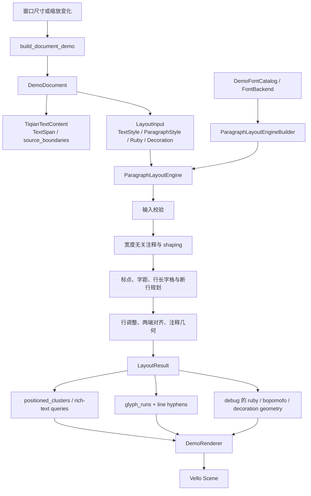
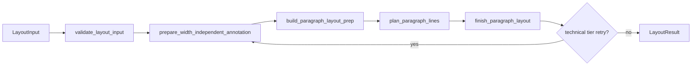
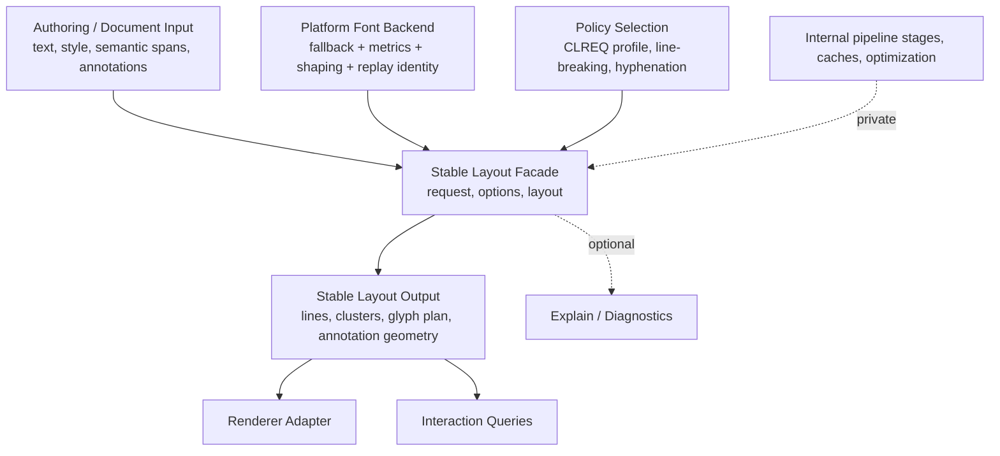

# tiqian-rs 对外 API 设计报告

> 调研日期：2026-08-31  
> 调研范围：`examples/paragraph-demo.rs`、`examples/fixture-layout-dump.rs`、`examples/paragraph_demo/`、`src/lib.rs`，以及 demo 直接使用的输入、引擎、字体、输出和查询模块。  
> 目标：记录当前“外部 Rust 调用方实际需要如何使用 tiqian-rs”，为后续公开 API 的新增、改进和大规模重设计提供事实基线。

## 结论摘要

当前 crate 的功能已经覆盖了段落输入、CLREQ 规则、字体接入、断行、字形重放、注音/装饰、富文本几何和交互查询；其产品级 facade 正由 builder 与具体引擎收敛。`api::ParagraphBuilder` 已提供按内容顺序生成现有输入字段的构造入口。`src/lib.rs` 将多数实现模块逐层 `pub mod` 暴露，外部调用方可直接访问大量算法和阶段类型。layout 执行入口为具体的 `ParagraphLayoutEngine::layout`，由 `api::ParagraphLayoutEngineBuilder` 以必填 `Box<dyn FontBackend>` 一次性组装；引擎的策略与组件字段均为私有。

桌面 demo 表明，生产级接入至少需要同时完成三件事：

1. 构造 `LayoutInput`，并以 Unicode scalar offset 表示所有 source range；
2. 实现一个 `FontBackend`，由 builder 注入引擎，统一提供字体候选、度量和 shaping 能力；
3. 使用 `LayoutResult` 的 glyph、line、debug annotation 和查询函数自行绘制、裁切、选择和命中测试。

当前 API 的主要问题是边界未收敛：配置、算法策略、平台后端、可绘制结果、诊断信息和内部阶段处于同一公开层级。调用方需要理解内部实现细节，才能做出正确且可重放的集成。

## 调研方法与边界

本报告把 demo 作为桌面外部用户，测试作为产品 API 的验证材料：

| 资料 | 角色 | 报告中的用途 |
| --- | --- | --- |
| `examples/paragraph-demo.rs` 与 `examples/paragraph_demo/` | 桌面应用示例 | 识别生产接入流程、字体后端要求、渲染和交互消费方式 |
| `examples/fixture-layout-dump.rs` | 开发期验证适配器 | 识别为 golden/调试而公开的低层策略和全部 debug surface |
| `src/lib.rs` | crate 出口 | 判断模块是否可被外部 crate 访问 |
| `src/*` | 实现说明 | 核对调用流程、输入输出所有权和默认行为 |
| `tests/core/layout_queries_test.rs` | 查询行为检查 | 核对交互与 renderer 查询的预期语义 |
| `docs/tracking.md` | 项目边界声明 | 核对 Rust 核心当前主动排除 frontend/platform adapter 的事实 |

本报告不评价 Kotlin 上游算法正确性，也不把当前 `pub` 自动等同于稳定承诺。下文的“当前公开”仅表示外部 crate 能编译引用；“建议稳定”表示未来产品 API 值得明确承诺的边界。

## 当前出口与可见性

### 模块出口

[`src/lib.rs`](../src/lib.rs) 没有根级 facade、prelude 或 `pub use`。调用方必须从深层模块路径导入类型，例如：

```rust
use tiqian::api::ParagraphLayoutEngineBuilder;
use tiqian::core::geometry::LayoutConstraints;
use tiqian::core::text_model::{LayoutInput, TiqianTextContent};
use tiqian::layout::paragraph_layout_engine::ParagraphLayoutEngine;
```

根模块公开的一级分组如下：

| 一级模块 | 当前性质 | 外部调用者可见的主要内容 | 评价 |
| --- | --- | --- | --- |
| `common` | 实现便利层 | `HashMap`、`HashSet` 的特性切换导出 | 不应成为业务 API 的必要依赖 |
| `api` | 段落构造与引擎组装层 | `ParagraphBuilder`、`ParagraphLayoutEngineBuilder`、构造期样式与结构错误 | 按内容顺序生成现有输入、颜色和富文本范围，并组装生产引擎 |
| `core` | 数据模型与查询 | `Text`、range、constraints、输入模型、布局结果、交互查询 | 最接近应稳定的公共数据层 |
| `clreq` | 排版规则与区域 profile | profile、禁则、标点、注音规则 | 含适合配置的类型，也混入规则实现细节 |
| `font` | 字体决策与度量接口 | font role、fallback、metrics 类型 | 平台接入必需，具体 shaping 由统一 backend 完成 |
| `shaping` | shaping 接口与字体 catalog | `FontBackend`、`FontBackendRequest/Result`、`ReplayableFontCatalog` | 主引擎通过统一 backend 消费候选、shaping、metrics 与 replay identity |
| `linebreak` | 换行工具与连字符 | `Hyphenator`、语言断词、Unicode 规则 | 一部分适合策略配置，另一部分是算法实现 |
| `layout` | 生产引擎和内部 pipeline 阶段 | `ParagraphLayoutEngine`、line breaker、justifier、stage、cache、内部 ledger | 生产引擎经过 builder 组装；阶段与缓存仍是公开实现目录，出口偏宽 |

`Cargo.toml` 的版本为 `0.1.0`，且 package `include` 仅包含 `src`、资源、manifest、README、LICENSE；`examples` 不会进入发布包。demo 是当前覆盖范围最广的集成证据，不会作为随 crate 发布的正式示例或入门 API。

### 两种外部用户画像

| 用户画像 | 入口 | 主要目的 | 直接使用的低层能力 |
| --- | --- | --- | --- |
| 桌面排版应用 | `paragraph-demo` | 使用平台字体 layout，重放 glyph 和装饰到 Vello | `FontBackend`、`LayoutResult` 字段、`layout_queries`、debug annotation |
| fixture/golden 工具 | `fixture-layout-dump` | 将 JSON 转输入，以不同 breaker 比对 Kotlin dump | profile resolver、hyphenator、三种 line breaker、全部 debug 字段 |

第二类调用方不是目标产品用户，但它通过公开 API 验证了测试工具能侵入实现配置。这一点需要在重设计时保留“诊断/验证专用入口”，同时不让它定义普通集成 API 的形状。

## API 分类

### 1. 文本与段落输入

输入层的中心类型是 [`LayoutInput`](../src/core/text_model.rs)。它由 `LayoutInput::builder(content, constraints)` 创建，随后用 builder 追加样式和注释。

| 分类 | 类型/入口 | 用途 | demo 使用情况 | 当前接口要点 |
| --- | --- | --- | --- | --- |
| 文本容器 | `Text` | 共享 UTF-8 存储的 source text | 所有样本文本 | source coordinate 不是 Rust UTF-8 byte offset |
| source range | `TextRange` | span、注释、选择、glyph 对应范围 | 高度频繁 | offset 单位是 Unicode scalar value |
| 内容 | `TiqianTextContent` | 文本、样式 span、cluster 边界、技术断行、autospace 抑制 | builder 输出 | 手工输入仍需维护纯绘制范围的边界 |
| 基础文本样式 | `TextStyle` | family、size、locale、weight、italic、baseline shift、attachment | 高频 | 可在 `TextSpan` 中按 range 覆盖 |
| 段落样式 | `ParagraphStyle` | 行高、首行/块缩进、末行对齐、字格、ruby 行高、写向 | 高频 | 默认启用字格量化与自适应首行缩进 |
| 尺寸约束 | `LayoutConstraints` | width、max height、max lines | 每次重排 | width 必须大于零；`max_height` 当前不产生对应的布局截断语义 |
| profile 选择 | `LayoutProfileId` | 选择 CLREQ profile | fixture 使用，desktop 用默认值 | 默认仅解析为大陆横排；未知 id 使用大陆横排 |
| 行间注 | `RubySpan` | 拼音/注音、字体、语言 | 桌面 demo 使用两种 | 影响不可断行和行高 |
| 行内盒 | `InlineBoxSpan` | text source range 周围的 layout-owned 边缘 | demo 未使用 | 用于 DOM padding/border 等语义 |
| 行内对象 | `InlineObjectSpan` | 公式/替换对象的 advance、ascent/descent、边缘调整 | demo 未使用 | renderer 保有实际对象，layout 只保有度量和断行语义 |
| 排版装饰 | `DecorationSpan` | 着重号、示亡号、专名号、书名号 | 高频 | 影响后续注释几何，不作为字体样式处理 |
| 富文本绘制元数据 | `RichTextSpan` | 背景、下划线、删除线、链接、code role | builder 输出 | 不属于 `LayoutInput`，由构建输出交给 renderer |

#### `source_boundaries` 的隐含负担

桌面 demo 在 [`sample.rs`](../examples/paragraph_demo/sample.rs) 中使用 `ParagraphBuilder` 按内容顺序追加文本和声明作用域。builder 生成 `TiqianTextContent`、`LayoutInput`、颜色和 `RichTextSpan`，并为颜色、rich text 与链接的起止位置维护 `source_boundaries`。布局相关 span 的边界继续由现有 pipeline 汇集。

手工构造 `TiqianTextContent` 仍保留这一跨层约束：即使范围不影响换行和度量，调用方仍须提前声明边界，才能获得精确的范围几何。builder 将重复工作收敛到构造层；`RichTextSpan` 仍通过 `ParagraphBuildOutput` 交给 renderer。

### 2. 引擎与算法策略

| 类型/入口 | 职责 | 当前默认 | 外部可替换方式 | 使用层级建议 |
| --- | --- | --- | --- | --- |
| `ParagraphLayoutEngine` | 具体生产 layout pipeline（非 trait） | 由 `ParagraphLayoutEngineBuilder::build()` 组装默认策略、字体后端和缓存 | 通过 `ParagraphLayoutEngineBuilder` 组装 | 稳定的最小执行边界 |
| `LineBreaker` | 断行策略 | `GreedyLineBreaker` | `ParagraphLayoutEngineBuilder::line_breaker(...)` | 高级策略扩展点 |
| `GreedyLineBreaker` | 贪心断行+repair | 默认 | 作为 `Box<dyn LineBreaker>` 传给 `ParagraphLayoutEngineBuilder::line_breaker(...)` | 普通用户不应直接依赖算法参数 |
| `LookaheadLineBreaker` | 有限前瞻断行 | fixture 显式使用 | 作为 `Box<dyn LineBreaker>` 传给 `ParagraphLayoutEngineBuilder::line_breaker(...)` | 验证/高级策略 |
| `ParagraphDpLineBreaker` | 段落全局 DP 断行 | fixture 显式使用 | 作为 `Box<dyn LineBreaker>` 传给 `ParagraphLayoutEngineBuilder::line_breaker(...)` | 验证/高级策略 |
| `ClreqProfileResolver` | 从 profile id 取规则 | 内置大陆横排 resolver | `ParagraphLayoutEngineBuilder::clreq_profile_resolver(...)` | 合理的领域扩展点，由 builder 统一注入 |
| `Hyphenator` | 西文断词 | `default_hyphenator()` | `ParagraphLayoutEngineBuilder::hyphenator(...)` | 合理的可选能力 |
| `WidthIndependentAnnotationCache` | 宽度无关注释缓存 | LRU | `ParagraphLayoutEngineBuilder::annotation_cache(...)` | 属于性能实现细节，按需由 builder 注入 |

### 3. 平台字体与 shaping 集成

桌面 demo 的 [`DemoFontCatalog`](../examples/paragraph_demo/font_backend.rs) 当前实现 `FontBackend`。应用通过 `ParagraphLayoutEngineBuilder::new(Box::new(catalog)).build()` 注入它，普通引擎只接收一个统一 backend。backend 负责候选选择、完整 shaping、metrics 和 replay identity；每次段落 shaping request 独立完成候选选择和完整 shaping，并以 request range 记录 `FontResolution`。`ReplayableFontCatalog` 由 backend 继承，用于保证最终 face 可被 metrics 和 glyph replay 共同解析。

### 4. 布局结果、绘制数据与诊断

`LayoutResult` 是当前输出中心：

| 字段 | 主要消费者 | 内容 | API 角色 |
| --- | --- | --- | --- |
| `input` | 查询、renderer、复制 | layout 时的完整输入副本 | 结果可自描述，但内存成本和耦合较高 |
| `size` | 容器/滚动 | 段落宽高 | 核心结果 |
| `clusters` | 断行结果、range 对应 | source/display text、advance、shift | 核心几何基础 |
| `glyph_runs` | 桌面 renderer | glyph id、glyph offset、bounds、可选 `render_font_key` | glyph replay 需要；非 glyph renderer 可能不需要 |
| `lines` | renderer、滚动、查询 | range、cluster membership、baseline、宽度、indent、hyphen | 核心结果 |
| `debug` | fixture dump、注音/装饰 renderer、诊断 | 20 余类结构化决策 | 当前同时承担产品绘制与开发调试 |

`LayoutDebugInfo` 的角色混杂尤为明显。其内容至少可分三类：

| 子类 | 示例字段 | demo 是否依赖 | 是否应与通用诊断绑定 |
| --- | --- | --- | --- |
| 可绘制注释 geometry | `ruby_decisions`、`bopomofo_decisions`、`decoration_decisions`、`decoration_segments` | 是 | 不应；它们是展示结果，应移至明确的 annotation/render output |
| 解释性排版决策 | kinsoku、行修复、justify、autospace、grid、metrics | fixture 是；桌面 demo 间接用于检查 | 可作为可选 explain/debug API |
| 实现过程证据 | font/shaping decision、break tiers、cache 相关结果 | fixture 是 | 应隔离为诊断级 API，避免成为常规 renderer 接口 |

### 5. 渲染、交互与富文本查询

[`core::layout_queries`](../src/core/layout_queries.rs) 是最接近前端适配层的公开 API。它从 `LayoutResult` 推导统一几何，不重新 shaping。

| 功能 | 入口 | 调用方价值 | 已验证的关键语义 |
| --- | --- | --- | --- |
| cluster 位置 | `positioned_clusters` | body glyph 绘制、链接、无障碍 | occupied box 与 glyph `draw_x` 可不同 |
| glyph ink 外沿 | `glyph_ink_bounds` | 防止斜体等字形墨迹被裁切 | 与选择/hit-test 的 occupied box 分离 |
| 行/范围几何 | `get_line_for_offset`、`get_bounding_box`、`get_bounding_boxes` | selection、link rect、overlay | range 按 Unicode scalar offset；可切分多 scalar cluster |
| caret 与 hit-test | `get_cursor_rect`、`get_offset_for_position` | 编辑器交互 | 普通位置定位 |
| 安全选择 | `get_selection_offset_for_position`、`coerce_selection_offset`、word boundary 查询 | 编辑器选择 | emoji ZWJ、组合序列等 interaction unit 不从中间切开 |
| 复制 | `get_text_for_copy` | 剪贴板 | 完整选中 ruby/注音 base 时追加读音 |
| 富文本分段 | `positioned_rich_text_segments`、`rich_text_background_segments`、`trimmed_rich_text_decoration_segments`、`rich_text_decoration_line_y` | background/underline/strike renderer | 复用布局几何，不由 renderer 猜测标点 glue |

桌面 demo 没有统一 renderer trait。它在 [`renderer.rs`](../examples/paragraph_demo/renderer.rs) 中直接遍历 `glyph_runs`、查 `positioned_clusters`，再手动读取 `debug` 内 ruby、bopomofo 和 decoration 数据。`RichTextSpan` 也由 demo 自己保存为 `DemoDocument.rich_text`，没有随 `LayoutInput` 或 `LayoutResult` 流转。

## 从桌面 demo 还原的完整调用链



引擎内部可以进一步按阶段理解为：



其中 `prepare_width_independent_annotation` 消耗 profile、字体 role/fallback、metrics、shaper、hyphenator；`plan_paragraph_lines` 消耗 normalizer、justifier 和 `LineBreaker`；`finish_paragraph_layout` 生成最终 line、glyph replay、注释 geometry 和 debug。该分层是良好的内部架构，但当前被 `layout` 模块完整公开。

## demo 实现的功能覆盖图

| 功能组 | demo 样张是否覆盖 | 使用的 API | 最终消费 |
| --- | --- | --- | --- |
| 简体中文正文和默认段落 | 是 | 默认 `TextStyle`、`ParagraphStyle`、`LayoutInput` | glyph replay |
| 响应式宽度与缩放 | 是 | 每次替换 `LayoutConstraints` 后重新 `layout` | 页面重排与滚动 |
| CJK/Latin 混排、font family、weight、italic | 是 | `TextSpan`、`TextStyle`、`FontBackend` | shape-once glyph replay |
| CLREQ 标点、禁则、行尾悬挂 | 是 | 内置 profile 与 builder 默认策略 | line 与 glyph geometry |
| 英文断词 | 是 | 默认 hyphenator、`LineBox.hyphen_glyphs` | 单独重放行尾连字符 |
| 列表 | 是 | demo 将 marker/body 当作两个独立 paragraph layout | host 负责 gutter、基线对齐 |
| 拼音 ruby、注音 | 是 | `RubySpan` | 从 `result.debug` 读取 glyph 与绝对位置 |
| 着重号、示亡号、专名号、书名号 | 是 | `DecorationSpan` | 从 `result.debug` 读取决策/segment |
| 背景、下划线、删除线、inline code | 是 | `RichTextSpan` + query 函数 | host renderer 逐段绘制 |
| 颜色 | 是 | demo 私有 `DemoColorSpan` | host 根据 source range 自行匹配 |
| emoji ZWJ、旗帜、keycap | 是 | 普通 `Text` + custom shaper | glyph runs 与 selection contract |
| vertical writing | 否 | `WritingMode::VerticalRl` 可输入 | 当前 demo 未证明 end-to-end renderer 路径 |
| `InlineBoxSpan` / `InlineObjectSpan` | 否 | 输入层可表达 | 当前 demo 未提供集成范式 |
| selection、caret、复制、hit-test | 未挂到 UI | `layout_queries` 可使用且有独立测试 | API 已存在，demo 未实际串接 |

这张图反映出一个重要边界：核心 layout 已能表达的能力，比桌面 demo 实际展示的更多；但“如何接入、如何绘制、如何交互”的标准路径尚只在部分能力上由 demo 间接说明。

## 关键设计特征

### Unicode scalar 是全 API 的 source-coordinate 标准

`ScalarOffset`、`TextRange`、`LineBox.range`、span、glyph cluster range、查询 offset 和 fixture wire 都使用 Unicode scalar value，而 Rust `str` 本身采用 UTF-8 byte offset。`Text` 集中负责两类坐标的映射。这是与 Kotlin 上游有意不同的 Rust API 约束，必须成为对外 API 的第一等文档和类型命名要点。

`TextRange::new` 只表达半开 scalar range；调用方仍需提供位于文本范围内的输入。`Text` 负责将有效 scalar range 映射为 UTF-8 slice，interaction query 则把 caret 与 selection endpoint 限制在 interaction boundary。集成层应定义何时验证、错误如何返回，以及是否提供从 Rust byte、scalar 或 grapheme 位置转换的官方工具。

### “layout 与 paint 一致”是当前最强的跨层接口

`Glyph` 记录 glyph id、shaper advance、偏移、bounds 和可选 `render_font_key`；`LineBox` 记录 synthetic hyphen glyph；ruby/bopomofo 也记录要重放的 glyph。桌面 demo 因而可以不重新 shaping，直接重放布局时已经确定的字形。

这是高价值设计：测量、断行和绘制能保持一致。但它要求 host 字体后端提供同一 face identity 的解析能力。当前这个约束由 `FontBackend` 及其继承的 `ReplayableFontCatalog` 表达，demo 使用同一个 `DemoFontCatalog` 通过 builder 注入。

### 当前结果是“布局结果 + renderer DTO + explain trace”的并集

这使 fixture dump 很强大，也让 renderer 可以读取注释几何；代价是：

- 一个仅需 line box 的用户仍获得完整输入、glyph 与所有决策；
- 注音/装饰的最终显示数据藏在 `debug` 命名空间；
- renderer 与诊断字段共同形成隐式兼容面；
- 性能优化（例如按需 glyph、按需 explain、缓存/增量）会受到单一大结果类型的约束。

### builder 与公有字段并存

输入模型广泛采用 builder，部分带值 enum 通过构造函数保持校验；这对 authored input 是积极的。`LayoutInput`、`TextStyle`、`ParagraphStyle`、`LayoutResult` 等输入和结果 DTO 仍有公有字段，便于构造和消费；production `ParagraphLayoutEngine` 的策略依赖则由 `ParagraphLayoutEngineBuilder` 组装，组件字段保持私有。

因此公开 API 同时支持“受控创建”和 DTO 字段访问两种方式。稳定边界主要由输入/输出 DTO 与 builder 组成，内部引擎配置不由调用方直接修改。

## 当前设计问题与重构关注点

以下是由现有调用事实推导出的设计风险；本报告不替未来方案作出决定。

| 优先级 | 观察到的问题 | 事实依据 | 对外影响 | 后续设计需回答的问题 |
| --- | --- | --- | --- | --- |
| 高 | 产品入口已使用 `ParagraphLayoutEngineBuilder` | 产品入口以必填 `FontBackend` 组装具体 production engine；确定性 backend 位于 test support | 生产路径和测试路径的字体依赖边界已明确 | 后续继续收敛 facade 与 renderer/diagnostic 输出边界 |
| 高 | 字体接入依赖平台 backend contract | demo 通过 `DemoFontCatalog` 实现并注入 `FontBackend`，统一提供候选选择、metrics、shaping 和 replay identity | 一致性由统一 backend contract 表达；平台仍需提供完整字体能力 | 后续是否继续细化 backend capability 与 renderer replay 边界？ |
| 高 | 绘制数据和诊断数据混在 `debug` | ruby/bopomofo/decoration renderer 读取 `result.debug` | renderer 绑定 debug schema，难以独立演进 | 最终可视 annotation 是否应成为正式 output；explain trace 如何按需获得？ |
| 高 | 富文本输入未随 layout input/result 统一流转 | `ParagraphBuildOutput` 将 `LayoutInput` 与颜色、`rich_text` 一并交给 demo；它们仍不属于 `LayoutInput` | builder 已消除手工范围和边界维护，renderer 输入仍是独立数据 | 后续是否将颜色和 rich text 收入统一输入接口？ |
| 中 | 一级公开模块等于内部实现目录 | `layout` 公开各 stage、cache、ledger、optimization | 外部代码会依赖重构敏感类型，增加兼容负担 | 哪些模块应为 public facade、advanced、debug、internal？ |
| 中 | 配置已通过 builder 一次性注入 | `ParagraphLayoutEngineBuilder` 统一组装必填字体 backend、cache 和策略；引擎组件字段为私有 | cache 和策略不再通过引擎公有字段修改，依赖组合更明确 | 后续是否继续细化 builder 的稳定配置边界？ |
| 中 | 结果复制原始 `LayoutInput` | `LayoutResult.input` 是完整值 | 大文本/多 span 的内存和生命周期固定绑定 | 是否区分 `LayoutSnapshot`、render plan、source/document reference？ |
| 中 | 错误通过 `assert!`/`panic!` 表达 | constraints、range、inline object、demo backend 多处如此 | 外部不可信/编辑中输入难以恢复 | 公共边界哪些情况应返回结构化错误，哪些保留编程错误断言？ |
| 中 | 约束语义未完全对称 | `LayoutConstraints` 有 `max_height`，文档重点实现 `max_lines` | 调用方可能期待高度裁切/溢出策略 | 每一项 constraint 的 layout、paint、interaction 语义是什么？ |
| 低 | `common::HashMap/HashSet` 泄露选择的集合实现 | demo 和公开接口使用该别名 | feature 切换渗入用户代码 | public input 是否改为 iterator/collection-neutral 接口或 std collection？ |
| 低 | 可用交互查询没有 demo 集成范式 | queries 有完整测试，desktop demo 未接入选择/鼠标 | 新 adapter 仍需自己拼接事件模型 | 是否提供 framework-neutral interaction adapter 示例？ |

## 可作为重设计基础的接口分层

下图列出依据当前依赖方向整理的边界候选，不表示具体 API 方案。任何重设计都应保持上层不依赖下层的实现细节。



基于当前事实，未来设计可以先固定下列决策问题，而不急于一次性改变算法：

1. **稳定入口**：普通调用方是否只需要一个可配置的 paragraph layout engine，而算法策略和缓存仅以选项出现。
2. **字体边界**：如何继续细化 `FontBackend` 的 capability 与 glyph replay 约束，同时保持 fallback、metrics、shaping 的一致性。
3. **输入归属**：颜色、link、rich text、source boundary 和 inline semantic 是否统一为 document/span 输入，还是明确划分“layout input”与“renderer metadata”并提供官方转换。
4. **输出分层**：哪些结果是每次 layout 必得的核心几何，哪些 glyph/annotation 是 renderer payload，哪些解释 trace 仅在诊断模式生成。
5. **可见性政策**：哪些模块允许高级用户自定义，哪些仅为 parity test 和内部 pipeline 使用；公开但不稳定的模块应如何迁移。

## 建议保留的现有优势

后续重构不应丢失下列已经由 demo 或测试体现的能力：

| 优势 | 现有体现 | 应保留的原因 |
| --- | --- | --- |
| source 与 display 分离 | `Cluster.text` / `display_text`、copy query | 标点替换和连字符不能破坏复制、选择和可访问性 |
| shape-once 重放 | glyph run、render font key、annotation glyph | 避免 layout 与绘制出现字体特性、fallback、ligature 漂移 |
| cluster occupied geometry 与 ink bounds 分离 | `positioned_clusters`、`glyph_ink_bounds` | 选择/hit-test 稳定，裁切仍能容纳字形墨迹 |
| 结构化而非字符串化的 debug | `LayoutDebugInfo` 的 decision struct | golden 比对和问题定位可重复、可机器读取 |
| 范围精确的交互查询 | selection/caret/copy/word boundary API | emoji、组合附加符、inline object 等文本边界不能退化 |
| profile 驱动 CLREQ 规则 | `ClreqProfileResolver`、profile 数据模型 | 区域/风格变体不应要求 fork 核心算法 |
| 平台字体后端可插拔 | `FontBackend` 和 desktop demo | crate 不绑定某个图形/UI 框架，仍能正确接入平台字体 |

## 现状下的最小集成清单

按当前 facade 接入时，外部应用正确使用当前 API 至少需要完成下列项目：

1. 使用 `api::ParagraphBuilder` 追加文本并声明范围，读取其生成的 `LayoutInput`、颜色和 rich text。
2. 手工构造 `TiqianTextContent` 时，将宿主文本位置转换为 Unicode scalar offset，构造 `TextRange`，并维护精确几何范围的 `source_boundaries`。
3. 用 `LayoutInput` 提供基础样式、段落样式、constraints、注音、装饰和行内对象。
4. 实现一个 `FontBackend`，并通过 `ParagraphLayoutEngineBuilder::new(Box::new(backend)).build()` 构造引擎；backend 统一提供候选选择、完整 shaping、metrics 和可重放的 face identity。
5. 从 `LayoutResult` 读取 glyph、line、查询结果以及当前位于 `debug` 中的 annotation geometry，完成 renderer、裁切和交互。

这一清单本身就是当前对外 API 尚未收敛的证据：它适合作为平台 adapter 的实现指南，但对一般应用调用方过于深入。

## 后续调研建议

本报告建立的是 Rust 侧可见性和 demo 使用基线。提出新的公开 API 前，建议按以下顺序补齐决策证据：

1. 对照 Kotlin 上游的 frontend/platform adapter，确认哪些输出字段在平台实现中被消费，尤其是 glyph replay、ruby、decorations 和 interaction。
2. 为 `InlineBoxSpan`、`InlineObjectSpan`、`VerticalRl`、selection/caret 建立端到端 demo 或最小 adapter，确认它们是否应进入首批稳定 API。
3. 为平台 backend 设计一个小型集成样例，验证字体 fallback、metrics、shaping、replay identity 可以由一个清晰的边界表达。
4. 列出所有外部路径会编译依赖的 `pub` 项，将其标记为 stable、advanced、diagnostic 或 internal，再决定迁移策略。
5. 在 API 方案确定后，基于本报告中的两个用户画像分别提供一个最小产品示例和一个诊断/fixture 示例，避免验证工具继续决定日常 API。